# NetCalib: A Novel Approach for LiDAR-Camera Auto-calibration Based on Deep Learning

This work is submitted as a paper to icpr 2020.

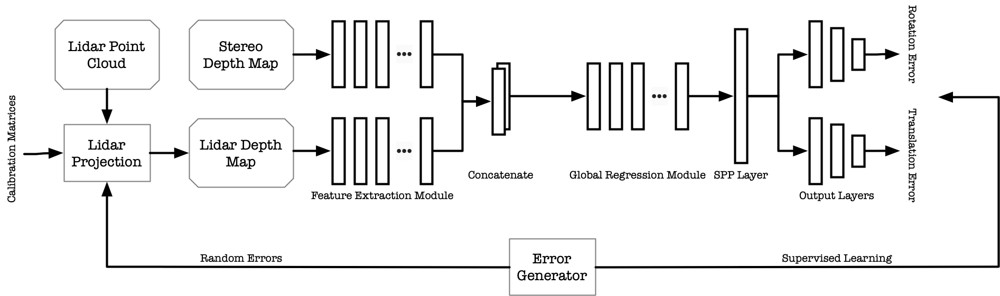

In this paper, we demonstrated a novel approach to calibrate the LiDAR and Stereo cameras using a deep neural network.
Firstly, LiDAR point cloud is projected to the depth map in the left camera's view, and the depth map for the corresponding stereo pair is calculated as well.
Next, two modality-specific feature extraction modules are used for two depth maps respectively to preprocess and extract features from each modality.
Then, the output feature maps are concatenated and they are fed to the global regression module that will learn the geometry correspondencies among modalities. 
A SPP layer is used after the output from previous module to provide a fixed length feature vector.
Finally, two sets of output layers are used for rotation errors and translation errors separately.

## Motivation
We are releasing our approach's source code for autocalibrating camera and lidar sensors to share with the scientific community and industry with the aim of the collaboration with people around the world to push the boundaries in the field of autonomous driving and intelligent transportation systems. 

## Experiment results
### 1. Losses
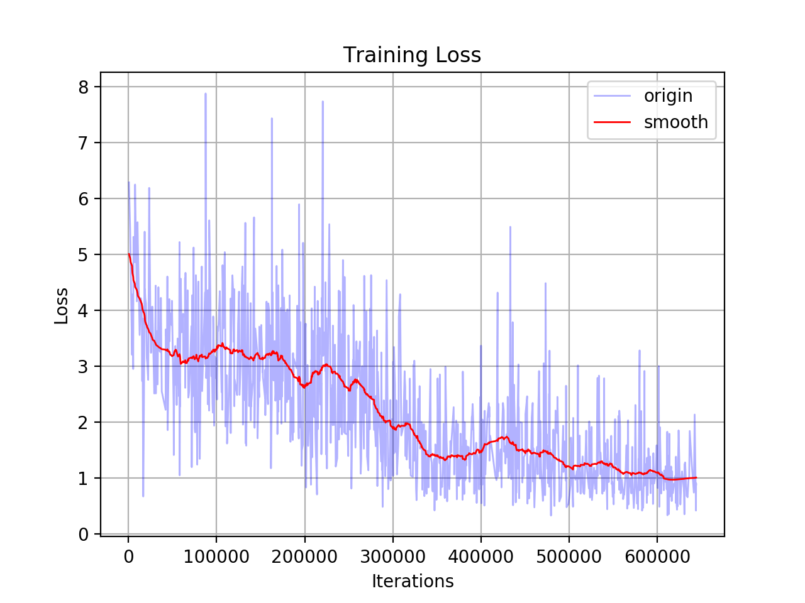 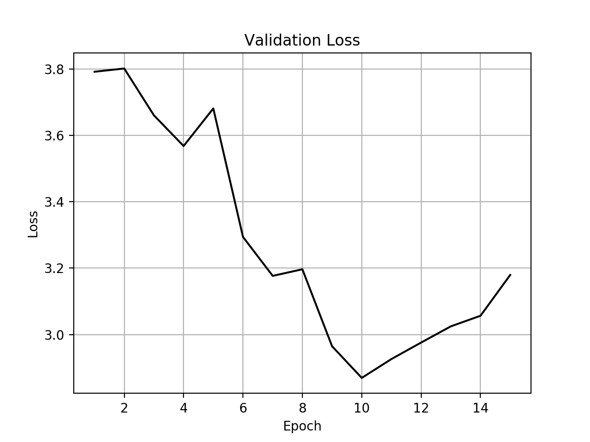 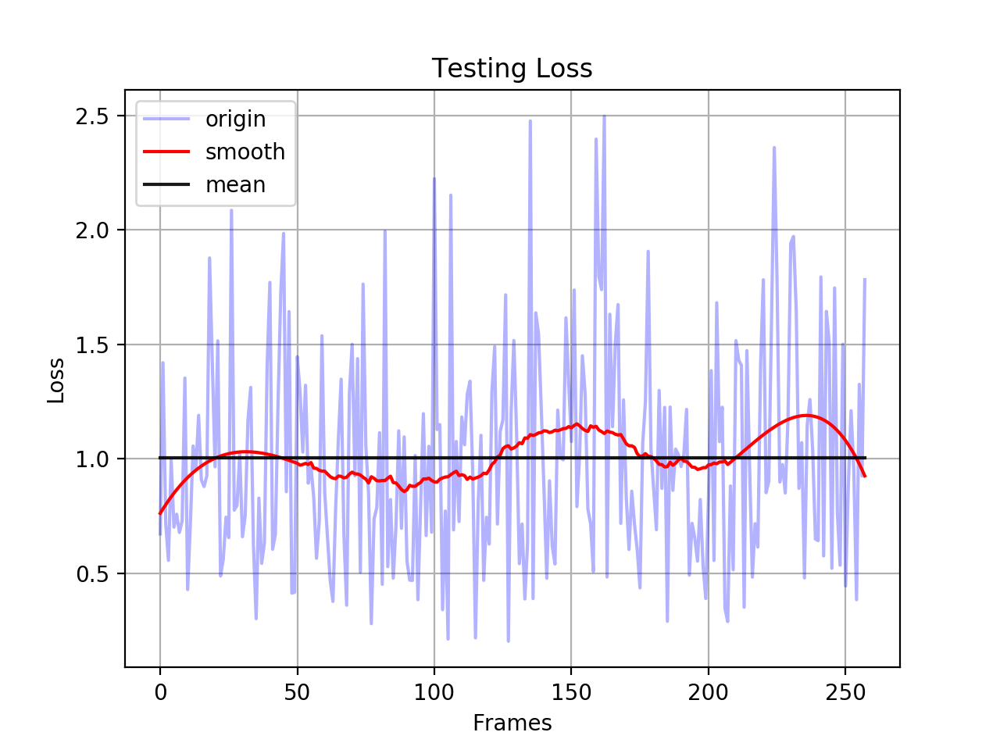

### 2. Model inference error
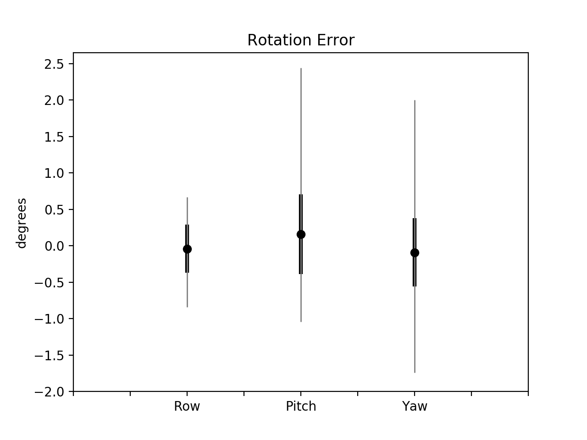 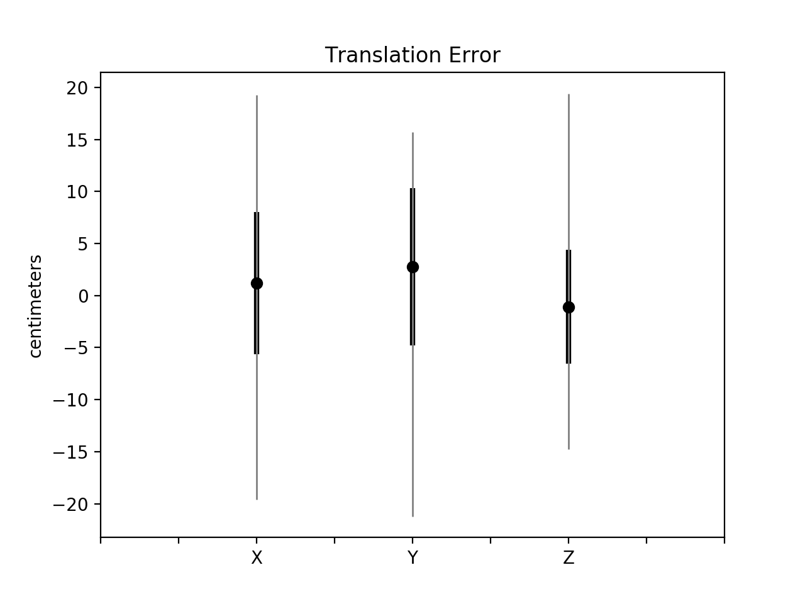

### 3. Visualization
| | Sample 1 | Sample 2 |
| :---:  | :---: | :---: |
| LiDAR with error | 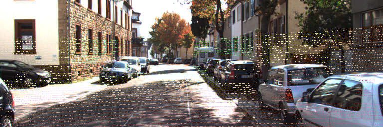 | 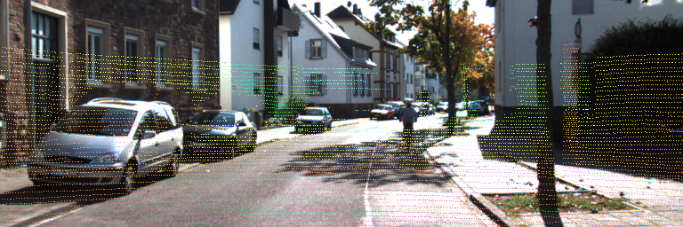|
| LiDAR fixed |  | 
| LiDAR ground truth | 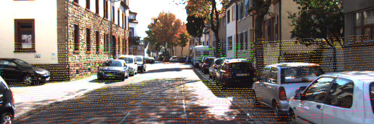 | 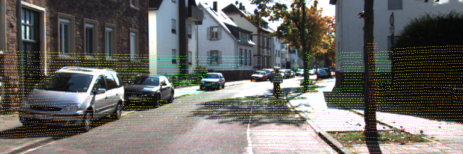
| Stereo depth | 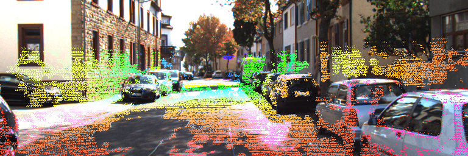 | 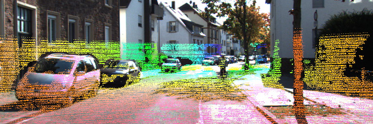

## Deployment
The codes were tested on Ubuntu 19.10 & 20.04 with Python 3.7 & 3.8. Generally, a Ubuntu 18.04+ with Python3+ will be compatible as long as you can install those required libraries.
For a list of all source code dependencies, please see [here](https://github.com/simonwu53/NetCalib-Lidar-Camera-Auto-calibration/blob/master/requirements.txt).

1. Clone the repo to your local drive. 
2. Setup your own Python environment and install the `requirements.txt` by command `pip3 install -r requirements.txt`. 
3. The installation of `pytorch` and `torchvision` may vary in the future, you can install manually via the [official website](https://pytorch.org/get-started/locally/).

## Train the model
Modify the configurations in `src/config.py`. 
You can start training the model from the beginning using `--train` argument. 
`--err` specifies the error range to use, which is defined in the configuration.

```shell script
python main.py --train --err 3
```

In order to continue training, you can add `--ckpt` argument to specify the pytorch checkpoint `tar` file.

## Test the model
You can test the trained model by the command below, where `--win-scale` changes the opencv window size.

```shell script
python main.py --test --err 4 --ckpt /home/user/NetCalib-Lidar-Camera-Auto-calibration/results/test1/ckpt/ckpt.tar --win-scale 2.5
```
## Licence 
NetCalib is released under a [GPLv3.0](https://github.com/simonwu53/NetCalib-Lidar-Camera-Auto-calibration/blob/master/LICENSE) license. 

For a closed-source version of NetCalib for commercial purposes, please contact the authors: <Shan.Wu@ut.ee>, <Amnir.Hadachi@ut.ee>


## Contributors
Shan Wu; Amnir Hadachi; Damien Vivet; Yadu Prabhakar.  

## Citation 
If you use NetCalib in an academic work, please cite:
```
@inproceedings{Shan2021NetCalib,
  title={NetCalib: A Novel Approach for LiDAR-Camera Auto-calibration Based on Deep Learning},
  author={Shan, Wu; Hadachi, Amnir; Vivet, Damien; Prabhakar, Yadu},
  booktitle={Proceedings of the 25th International Conference on Pattern recognition 2020},
  year={2020},
  organization={IEEE}
}
```

Preprint version of the paper is [here]().


